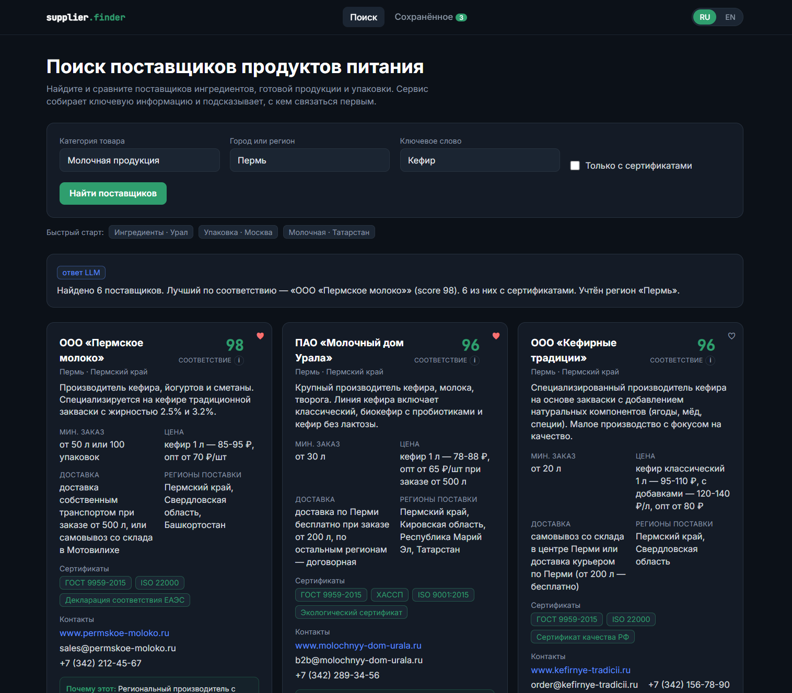
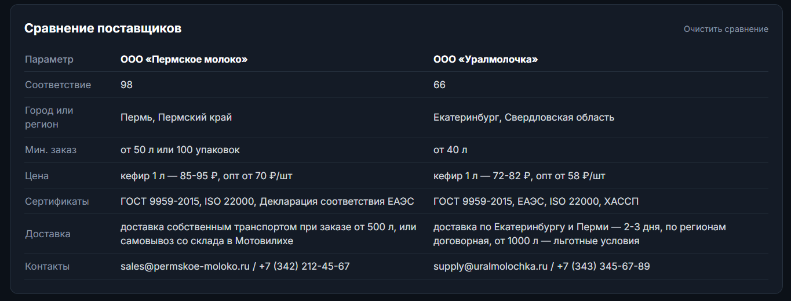
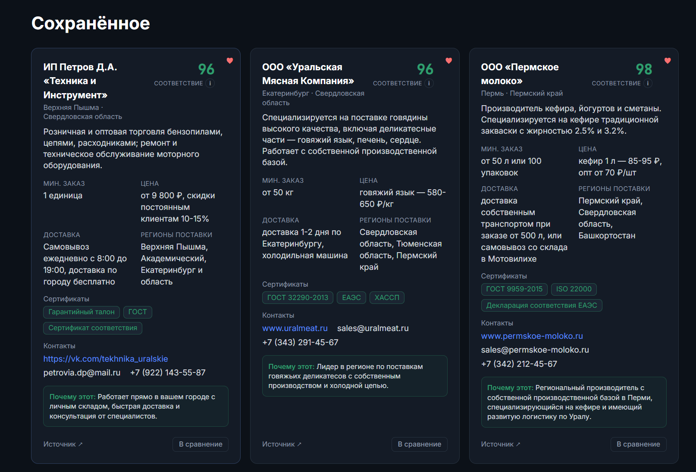
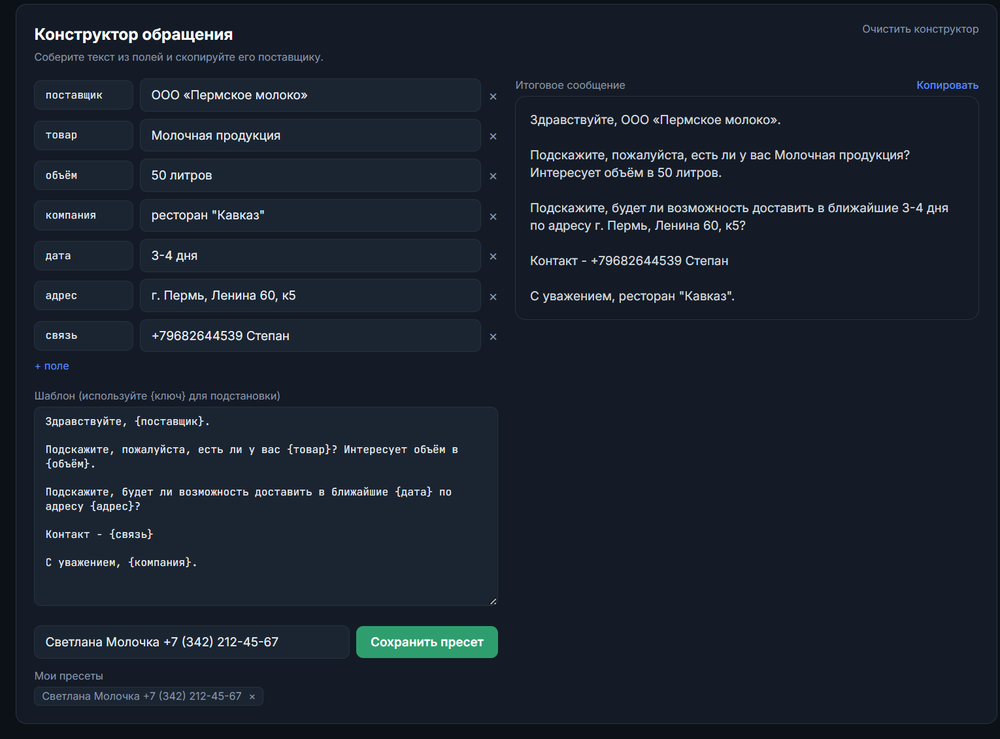

# Поиск поставщиков продуктов питания

Сервис помогает быстро **найти и сравнить поставщиков** food-направления
(ингредиенты, готовая продукция, упаковка) и понять, **с кем связаться первым**.

🔗 **Репозиторий:** https://github.com/Petrfall/supply-finder
🧩 **Стек:** FastAPI + SQLite + React (TypeScript) · LLM-провайдер (Claude)

> ⚠️ **О данных.** В текущей демо-конфигурации поставщики **синтетические** —
> модель генерирует правдоподобные карточки под запрос (название, контакты в
> формате РФ, цены в ₽, сертификаты ГОСТ/ЕАЭС/ISO/ХАССП и т.д.), помеченные как
> демо. Это сделано осознанно: показать **рабочий пайплайн** (генерация →
> строгая схема → скоринг → сравнение) на дешёвом и стабильном ключе, без
> привязки к платному веб-поиску. **Боевой режим с реальным веб-поиском уже
> реализован** и включается одной строкой в `.env` — см.
> [«Провайдеры и режимы»](#провайдеры-и-режимы).

---

## Что умеет (скриншоты)

### Поиск и карточки поставщиков
Категория + город/регион + фильтры (только с сертификатами, ключевое слово).
По каждому поставщику собираются: контакты, сайт/источник, **MOQ, цена,
сертификаты, условия доставки, регионы поставки**, а также **fit-score** (0–100)
с объяснением «почему этот».



### Таблица сравнения
До 4 поставщиков бок о бок по ключевым параметрам — чтобы решение принималось
за секунды, а не перелистыванием карточек.



### Сохранённое (избранное)
Отмеченные поставщики складываются в личный список — безрегистрационный «ЛК»
на основе анонимного `client_id`, который браузер генерирует сам.



### Конструктор обращения
Готовит персональное письмо/сообщение поставщику по шаблону (товар, объём,
условия, контакт). Шаблоны можно сохранять как **пресеты** и переиспользовать —
первый шаг к будущей авторассылке.



---

## Идея

Специалист по закупкам тратит часы на ручной обход сайтов и агрегаторов, чтобы
собрать по поставщику разрозненные данные (MOQ, цены, сертификаты, контакты) и
сравнить их. Сервис автоматизирует именно сбор, нормализацию и ранжирование:

1. Пользователь задаёт **категорию** и **город/регион** (+ фильтры).
2. Сервис получает поставщиков, **приводит данные к единой строгой схеме** и
   нормализует их.
3. **Детерминированный скоринг** ранжирует поставщиков по соответствию запросу и
   подсказывает, с кем связаться первым — с объяснением, *почему*.

## Как это работает

```
Запрос (категория + регион + фильтры)
   │
   ▼  POST /api/search
FastAPI
   ├─ 1. cache lookup (SQLite по хэшу запроса) ──► hit → отдаём мгновенно
   ├─ 2. provider (см. «Провайдеры и режимы»):
   │      • OpenAI-совместимый (apinet.cloud): LLM генерирует поставщиков → JSON
   │      • Anthropic (live): web search → дайджест, затем извлечение в схему
   │      • mock (нет ключей): пусто → переходим к seed
   ├─ 3. seed fallback (если live пусто или ключей нет)
   ├─ 4. нормализация + дедуп (по домену/названию, слияние полей)
   ├─ 5. СКОРИНГ в коде (region/category/contacts/certs/MOQ/price/delivery)
   ├─ 6. краткая сводка «кого выбрать» + причина у топ-поставщика
   └─ 7. запись результата в кэш
   │
   ▼
React: карточки + фильтры + сравнение + избранное + конструктор обращения (RU/EN)
```

### Почему именно так (обоснование формата)

- **Скоринг считает код, а не модель.** Каждый балл прослеживается до правила
  (`backend/app/scoring.py`), и один и тот же запрос всегда даёт один результат —
  это аудируемо, в отличие от «модель сказала 87».
- **Provider-абстракция.** Источник данных за одним интерфейсом: можно щёлкнуть
  между генерацией (apinet), реальным веб-поиском (Anthropic) и демо-seed без
  единой правки в бизнес-логике. Тот же паттерн — в
  [resume-scorer](https://github.com/Petrfall/resume-scorer).
- **Строгая схема (Pydantic).** Что бы ни вернула модель, на выходе — валидный
  `Supplier[]`; битые записи отбрасываются, остальные сохраняются.
- **Кэш по хэшу запроса (SQLite).** Не платим за один и тот же запрос дважды;
  он же позволяет закоммитить «прогретые» запросы для офлайн-демо.
- **Source-attribution.** На карточке — ссылка на источник: прозрачность данных.

## Функциональность

- Поиск по **категории** и **городу/региону**.
- Фильтры: только с сертификатами, ключевое слово.
- По каждому поставщику: контакты, сайт/источник, **MOQ, цена, сертификаты,
  условия доставки, регионы поставки**, заметки.
- **Fit-score** + объяснение «почему этот» + сводка «с кем связаться первым».
- **Таблица сравнения** до 4 поставщиков бок о бок.
- **Сохранённое** (избранное) — безрегистрационный список на `client_id`.
- **Конструктор обращения** с сохраняемыми пресетами.
- Двуязычный интерфейс **RU / EN**.

## Провайдеры и режимы

Выбор провайдера в `backend/app/providers.py → get_provider()`:
**Anthropic-ключ → OpenAI-совместимый ключ → mock.**

| Режим | Условие в `.env` | Поведение |
|---|---|---|
| **apinet.cloud (текущий)** | задан `OPENAI_API_KEY` (+ `OPENAI_BASE_URL`, `OPENAI_MODEL`), `ANTHROPIC_API_KEY` пуст | LLM **генерирует** поставщиков под запрос. Данные синтетические, быстро (~15 c), дёшево. |
| **Anthropic (боевой)** | задан `ANTHROPIC_API_KEY` | **Реальный веб-поиск** Anthropic → извлечение в схему. Настоящие компании, сайты, телефоны. Дороже и медленнее (~30–60 c). |
| **Демо (без ключей)** | оба ключа пусты | Отдаёт seed-датасет — прототип открывается и работает «из коробки». |

Переключение между режимами — это правка `.env` и перезапуск контейнера, **без
изменений кода**. Чтобы включить настоящий веб-поиск, раскомментируйте
`ANTHROPIC_API_KEY` в `.env` и пересоберите backend.

## Запуск

### Через Docker (рекомендуется)

```bash
# 1. Заполните .env (см. .env.example): ключ apinet или Anthropic
# 2. Сборка и запуск:
docker compose up --build
# фронт:   http://localhost:8080
# бэкенд:  http://localhost:8000/api/health
```

Без ключей сервис стартует в демо-режиме на seed-данных.

### Локально без Docker

```bash
# backend
cd backend
uv venv && uv pip install -r requirements.txt
uv run uvicorn app.main:app --reload          # http://127.0.0.1:8000

# frontend (в другом терминале)
cd frontend
npm install && npm run dev                     # http://127.0.0.1:5173
```

Vite в dev-режиме проксирует `/api` на бэкенд (см. `vite.config.ts`).

## Структура

```
backend/app/
  models.py      # Pydantic-контракты (Supplier, ScoredSupplier, запрос/ответ)
  providers.py   # Anthropic (web search) | OpenAI-совместимый (apinet) | mock
  scoring.py     # детерминированный fit-score по взвешенным сигналам
  dedup.py       # дедуп по домену/названию со слиянием полей
  cache.py       # SQLite-кэш по хэшу запроса
  store.py       # хранение избранного и пресетов по client_id
  seed.py        # демо-датасет RU-поставщиков (fallback без ключей)
  main.py        # FastAPI: /api/search, /api/saved, /api/presets, /api/health
frontend/src/
  App.tsx                  # поиск, карточки, сравнение, избранное, язык
  components/
    SupplierCard.tsx       # карточка поставщика
    ComparisonTable.tsx    # таблица сравнения
    MessageBuilder.tsx     # конструктор обращения + пресеты
  lib/                     # api-клиент, типы, i18n (RU/EN)
```

## Что можно улучшить дальше

Сервис намеренно собран как расширяемый прототип. Очевидные направления роста:

- **Реальный веб-поиск по умолчанию.** Инструмент уже встроен (Anthropic web
  search) — остаётся вывести его в основной режим и/или добавить альтернативные
  источники (специализированные API, парсеры агрегаторов, открытые реестры).
- **Авторассылка.** Конструктор обращения + пресеты — фундамент: добавить
  очередь, SMTP/мессенджеры и отправку сразу нескольким поставщикам с трекингом
  ответов.
- **Автосравнение ответов поставщиков.** Принимать входящие письма/прайсы,
  извлекать условия в ту же схему и автоматически сводить в таблицу сравнения —
  чтобы выбор делался по факту присланных предложений, а не по витрине.
- **Интеграция с 1С / ERP.** Двусторонний обмен: подтягивать номенклатуру и
  историю закупок из 1С, а выбранных поставщиков и заявки выгружать обратно
  (контрагенты, договоры) — встраивание в реальный закупочный контур.
- **Более глубокий анализ логистики.** Расчёт стоимости и сроков доставки до
  конкретного адреса (геокодинг + тарифы перевозчиков), учёт минимальной партии
  и плеча доставки в скоринге — ранжирование по итоговой landed-цене, а не по
  цене за единицу.
- **База знаний поставщиков.** Накопление найденных компаний, дедуп по ИНН,
  обогащение из открытых реестров, векторный поиск (pgvector/Qdrant) по истории.
- **Экспорт и отчётность.** Выгрузка сравнения в CSV/PDF, история запросов,
  командные заметки по поставщику.
```
